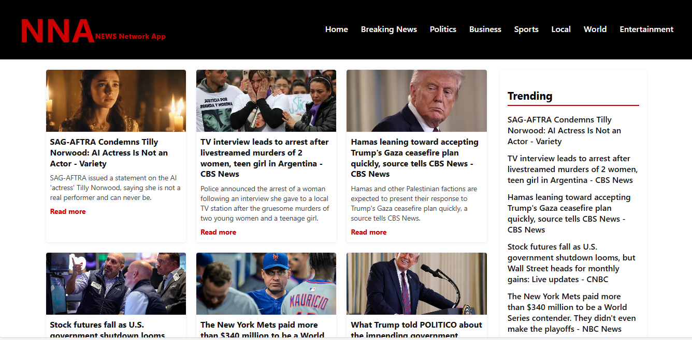

# NEWS Website

A real-time news web application built to deliver up-to-date headlines through a clean, user interface.



## Overview

NEWS-Website is a frontend-focused web application developed using HTML, CSS, JavaScript, and React. It consumes external news APIs to display real-time headlines, supports keyword-based search, and organizes content for easy consumption. The project emphasizes API integration, component-based architecture, and practical React fundamentals.

## Key Features

- Real-time news fetching using external APIs  
- Search functionality for specific news topics  
- Categorized and trending headlines  
- Modular React component structure

## Tech Stack

- **Frontend:** HTML, CSS, JavaScript, React  
- **API:** NewsAPI  

## Getting Started
  
### Installation

```bash
git clone (https://github.com/Kethnulee-Weerasinghe4/NEWS-Website)
cd NEWS-Website
npm install
